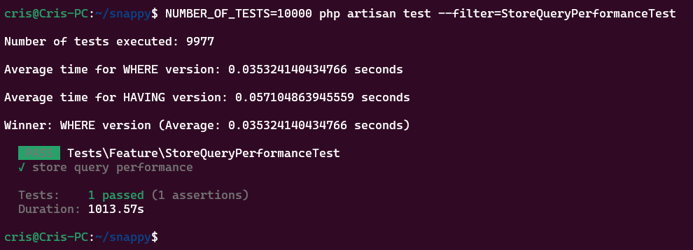

<p align="center"></a></p>

## Dependencies

-   php 8.3.6
    -   php-cli
    -   php-common
    -   php-opcache
    -   php-readline
    -   php-zip
    -   php-mbstring
    -   php-xml
    -   php-sqlite3
-   composer 2.8.5
-   node 18.19.1
-   npm 9.2.0
-   unzip 6.0.0

## Installation

```sh
git clone https://github.com/CRISvsGAME/snappy.git
cd snappy
composer install
npm install
npm run build
php artisan migrate
composer run dev
```

## (Optional) Seeding

```sh
# Importing 2,683,735 postcodes
php artisan import:postcodes Data/ONSPD_NOV_2022_UK.csv 0 https://parlvid.mysociety.org/os/ONSPD/2022-11.zip
```

```sh
# Seeding 100,000 stores (VERY EXPENSIVE computation and I/O operations)
# Consider setting STORE_SEED_ROWS environment variable to the desired value

# !!! DON'T run this with 100,000 if you don't have a super beefy PC !!!

php artisan db:seed
```

```sh
# For most use cases
STORE_SEED_ROWS=1000 php artisan db:seed
```

## import:postcodes

The `import:postcodes` command is defined in the file located at:

```php
App\Console\Commands\ImportPostcodes
```

You can view all available options by running:

```sh
php artisan import:postcodes --help
```

## API Endpoints

-   GET /api/stores – List all stores.

```sh
#Example:
curl -X GET http://localhost:8000/api/stores \
  -H "Content-Type: application/json"
```

-   POST /api/stores – Create a new store.

```sh
# Example:
curl -X POST http://localhost:8000/api/stores \
  -H "Content-Type: application/json" \
  -d '{"name": "Store 1", "lat": 40.712776, "long": -74.005974, "is_open": true, "store_type": "Grocery", "max_delivery_distance": 15}'
```

-   PUT/PATCH /api/stores/{store} – Update a store.

```sh
# Example:
curl -X PUT http://localhost:8000/api/stores/1 \
  -H "Content-Type: application/json" \
  -d '{"name": "Different Name"}'
```

-   DELETE /api/stores/{store} – Delete a store.

```sh
# Example:
curl -X DELETE http://localhost:8000/api/stores/1 \
  -H "Content-Type: application/json"
```

-   GET /api/stores/near/{postcode} - Return stores near to a postcode

```sh
curl -X GET http://localhost:8000/api/stores/near/HA5%202AH \
  -H "Content-Type: application/json"
```

-   GET /api/stores/delivery/{postcode} - Return stores that can deliver to a given postcode

```sh
curl -X GET http://localhost:8000/api/stores/delivery/HA5%202AH \
  -H "Content-Type: application/json"
```

## Models

```php
App\Models\Postcode
App\Models\Store
```

## Controllers

```php
App\Http\Controllers\Api\StoreController
```

## Middlewares

```php
App\Http\Middleware\EnsureJsonResponse
```

## Factories

```php
Database\Factories\StoreFactory
```

## Seeders

```php
Database\Seeders\StoreSeeder
```

## Tests

```php
Tests\Feature\StoreQueryPerformanceTest
```

```sh
# NUMBER_OF_TESTS is OPTIONAL and defaults to 100
# Example:
NUMBER_OF_TESTS=200 php artisan test --filter=StoreQueryPerformanceTest
```



## Improvements

### `import:postcodes`

-   Thorough validation
-   Flexibility and configuration

### Database

-   Production database like MySQL or PostgreSQL to enforce data types

### Models

-   Mutators and Accessors to set and retrieve data

### Migrations

-   Use of more accurate data types for columns

### Requests

-   Creating form request classes for data validation for separation of concerns

### Grouping and Ordering Filters

-   Using "GROUP BY" and "ORDER BY" to filter stores

### API Versioning

-   To comply with SOLID and REST principles, versioning of the API.

### Testing

-   Feature testing for the endpoints, though I focused on performance testing

## Known Issues and Limitations

-   SQLite doesn't enforce data types
-   Used the "pcd" column only for postcodes (pay attention to spaces)
-   The code has not been taken through refactoring
-   Non comprehensive inline documentation has been added for brevity
-   Commit history has not been rebased and cleaned up
-   Mixed casing between camel, snake and pascal case
-   Use of Haversine formula to calculate distance (in kilometers)
-   .env file is added to the source code for easiness (it shouldn't)

## License

This repository is a temporary dummy project. [License](https://crisvsgame.com/license).

The logo is Copyright of [Snappy Shopper](https://www.snappyshopper.co.uk/).
